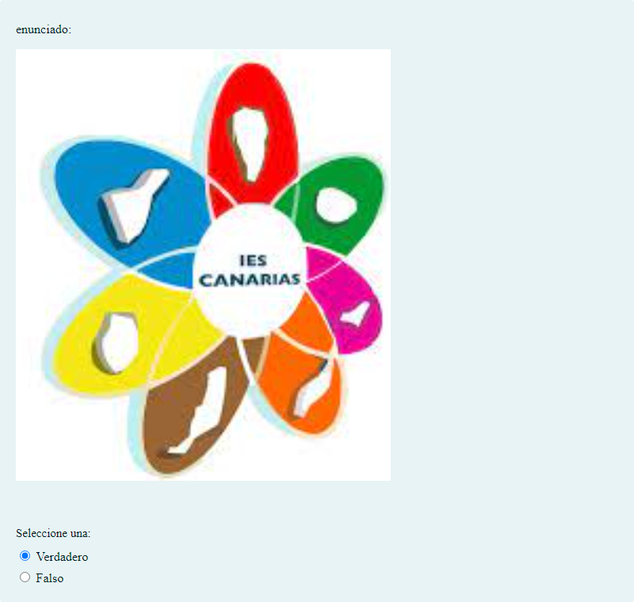

# sample1

Test para probar el funcionamiento del organizador de actividades incluyendo activity.json

## Contenido

Ficheros de preguntas disponibles en esta actividad:

### [questions1.xml](questions1.xml)

|   | Tipo              | Cantidad                   |
| - | ----------------- | -------------------------- |
|  | [Arrastrar y soltar imagen o texto](#arrastrar-y-soltar-imagen-o-texto) | 1 |
|  | [Arrastrar y soltar marcador](#arrastrar-y-soltar-marcador) | 1 |
|  | [Ensayo](#ensayo) | 3 |
|  | [Selección múltiple](#selección-múltiple) | 2 |
|  | [Respuesta corta](#respuesta-corta) | 1 |
|  | [Verdadero/Falso](#verdaderofalso) | 3 |
|   | **TOTAL**         | 11 |

#### Arrastrar y soltar imagen o texto

#### Arrastrar y soltar marcador

#### Ensayo

#### Selección múltiple

#### Respuesta corta

#### Verdadero/Falso

### [questions2.xml](questions2.xml)

|   | Tipo              | Cantidad                   |
| - | ----------------- | -------------------------- |
|  | [Arrastrar y soltar imagen o texto](#arrastrar-y-soltar-imagen-o-texto) | 1 |
|  | [Arrastrar y soltar marcador](#arrastrar-y-soltar-marcador) | 1 |
|  | [Ensayo](#ensayo) | 3 |
|  | [Selección múltiple](#selección-múltiple) | 2 |
|  | [Respuesta corta](#respuesta-corta) | 1 |
|  | [Verdadero/Falso](#verdaderofalso) | 3 |
|   | **TOTAL**         | 11 |

#### Arrastrar y soltar imagen o texto

#### Arrastrar y soltar marcador

#### Ensayo

#### Selección múltiple

#### Respuesta corta

#### Verdadero/Falso

